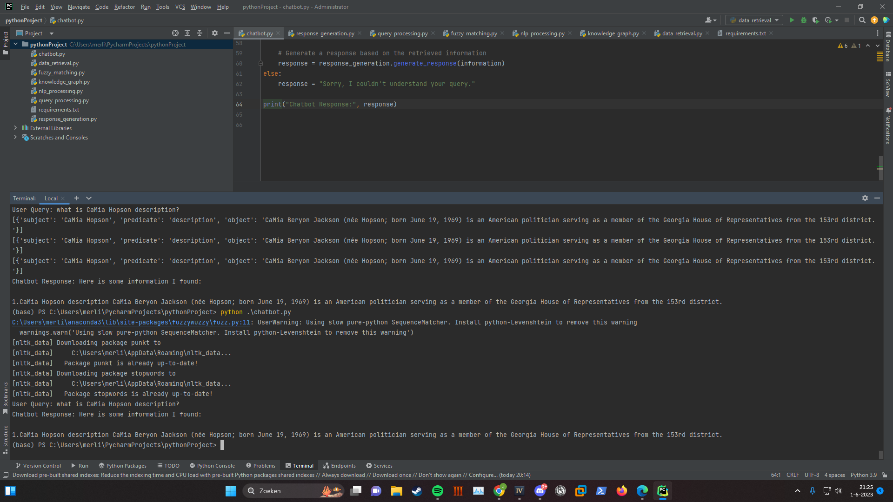

Test With 1 file that it works and can find stuff!

## Information

The chatbot takes wike pedia articles from the dbpedia you can change the amount to any you like or your pc can handle
the screen shot above here just show it works with 1 and it just create a dictonary when handing in this assigment ill
put it on 10k and there it worked to with

name: Merlijn Busch

studentnumber: 660571

python version: Python 3.9.13